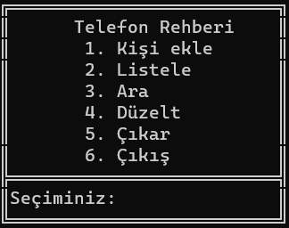
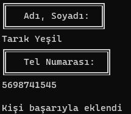
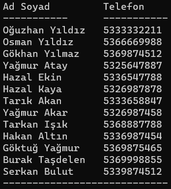
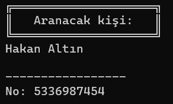
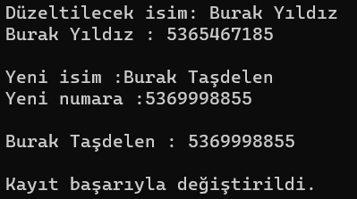

<h1>Telefon Rehberi</h1>

<strong><i>Vektörel Bilişim</i></strong> kursunun python dersinin 2. projesidir. Telefon rehberine veri ekleme, çıkarma ve silme gibi işlemleri yapan programları içerir

<h3>Anamenu</h3>

Rehber işlemlerini yapan programları içerir

<h3>1. Kişi Ekle</h3>

Kişinin <i>adını, soyadını ve telefonunu</i> kaydeder.

<h3>2. Listele</h3>

Telefon rehberine kayıtlı kişileri listeler

<h3>3. Ara</h3>

Aranan kişinin telefon numarasını <strong>ekrana</strong> yazar

<h3>4. Düzelt</h3>

Rehberdeki <strong><i>kişi ve telefon numarasını</i></strong> değiştirme işlemini yapar

