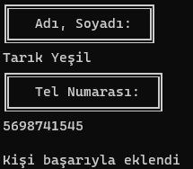

<h1>Telefon Rehberi</h1>

Vektörel bilişim python dersinin 2. projesi olup veri ekleme çıkarma ve silme işlemleri gibi uygulamaları içerir

<h3>Anamenu</h3>

<h3>Kişi Ekle</h3>

Kişinin <i>adını soyadını ve telefonunu</i> kaydeder.

Silme, değiştirme işlemlerini de içerir

